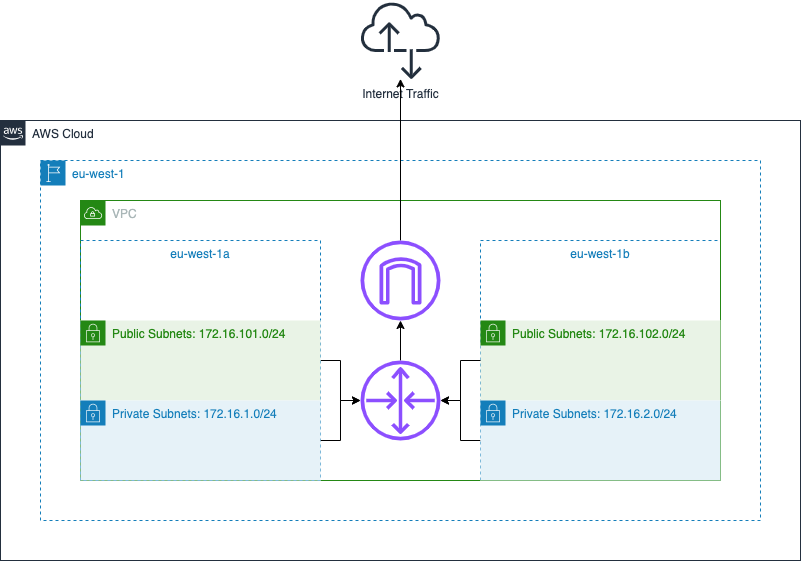

# Portfolio Cloud Projects

## Target Audience

As these are technical projects it's highly recommended that you as a reader have had at least a few years of experience in cloud (AWS) and Linux administration.

This will allow you to digest the abbreviations without problems, and understand the design decisions I've made.

But if you're curious about them I've added a `#Abbreviations Used in Document` section further down in each `README.md` within the projects.

## What to Expect from Me

Throughout all my projects I try to aim for a clear and structured approach since when several technologies are used things can quickly become complicated.

## Projects List

- WordPress Monolithic
- WordPress Decoupled (WIP)
- WordPress EKS (WIP)
- CF with Static Website (WIP)
- EventDriven Architecture (WIP)

Over time this section will be updated regularly as projects change throughout my experience and market demands.

## Additional Topics

### IaC: Terraform

For several years TF has been the de facto standard for deploying cloud infrastructure alongside other tools like CloudFormation, Pulumi, etc.

I've selected TF due to its popularity and since it has wide support for providers outside of the normal cloud sphere. I for eg. use it with providers such as GitHub, asymmetric key generation, ACME certificates, etc.

#### Custom Modules vs. Public Modules

While I understand we often create our modules to suit our needs, there are plenty of them that in most cases could be used instead.

One of them is the VPC or even SG which covers a lot of the use cases and receives regular updates and feedback from the community.

> Don't reinvent the wheel

### CM: Ansible

When it comes to CM there are several options out there such as Puppet, Chef, and Ansible, and while it's possible to create shell scripts I do believe they can quickly become difficult to read and manage.

Ansible is my choice due to the wide support from the open-source community, however further on in my project, you'll see me using more declarative methods.

Ultimately one of the weaknesses of Ansible is that it's an imperative language.

### Network: AWS VPC



When it comes to network resources in AWS we have two options, either we deploy something that takes care of the network for us like Elastic Beanstalk or we do it ourselves.

While I do understand the need to quickly deploy resources, particularly if your knowledge is limited. This can over time become a limitation as the environments grow and need to be decoupled into smaller pieces.

And often we need to have full control over our network which is why it's more beneficial over time to not use the AWS default resources created with each account.

### DNS: AWS Route53

All of our communication today is handled through DNS and even in internal networks which are hidden from the public.

Therefore I use AWS Route53 on all of my projects as I find it critical to understand the basics of how to deploy services with DNS involved.

### Encryption in Transit: SSL/TLS Certificates

Another topic that is a de facto standard today is securing our communication in transit with HTTPS (SSL/TLS).

There's no reason not to use certificates in everything we deploy, and with TF we automate much of the work.

### Filter Traffic from the Internet

Quite often when we are learning we allow traffic from any public IP address just to get started with our projects and studies. However, this exposes us to unnecessary risk when combined with poor knowledge of security around passwords, API keys, and Linux.

I've been here countless times and I used to wonder, did I secure my environment enough? So to bring peace of mind, only allow access from your public IP address that you're working from.

With TF you can even automate much of the work.

```terraform
data "http" "my_pub_addr" {
  url = "https://ipv4.icanhazip.com"
}

locals {
  my_pub_addr_cleansed = "${chomp(data.http.my_pub_addr.response_body)}/32"
}
```

### AWS Default Tags

Let's keep our resources organized and structured from the beginning so let's make use of AWS tags automatically.

I use for eg. the TF AWS provider `default_tags` to ensure all the resources get these as a bare minimum.

```terraform
provider "aws" {
  region = var.region_code_execution

  default_tags {
    tags = {
      Environment      = var.env_name_long
      EnvironmentShort = var.env_name_short
      Project          = var.project_name
      Owner            = var.owner
      TerraformCreated = true
    }
  }
}
```
