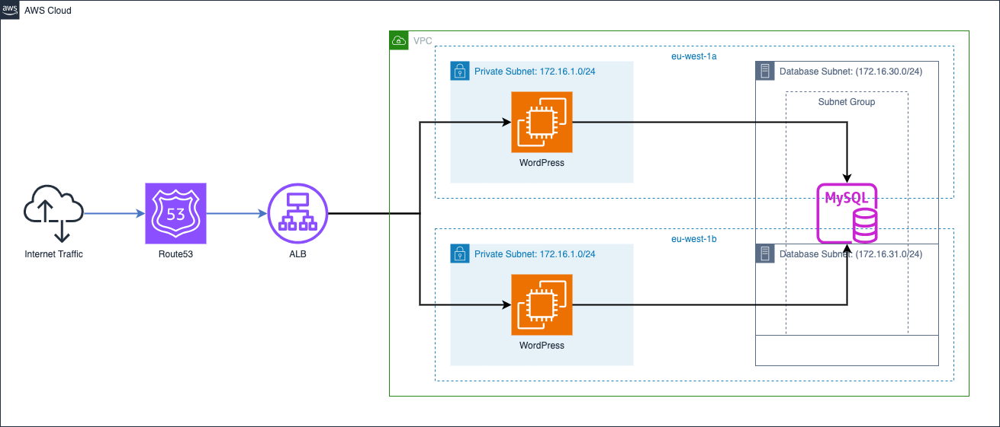

# WordPress Decoupled

- [1. Architecture Overview](#1-architecture-overview)
- [2. Technologies](#2-technologies)
  - [2.1. Reqired](#21-reqired)
  - [2.2. Used](#22-used)
- [3. Deployment](#3-deployment)
  - [3.1. Prerequisites](#31-prerequisites)
  - [3.2. Create](#32-create)
  - [3.3. Cleanup](#33-cleanup)
- [4. Project Details](#4-project-details)
  - [4.1. Tree Structure](#41-tree-structure)
  - [4.2. Security: SSM](#42-security-ssm)
  - [4.3. Security: SG](#43-security-sg)
- [5. Abbreviations Used in Document](#5-abbreviations-used-in-document)
- [6. Future Work](#6-future-work)

## 1. Architecture Overview



## 2. Technologies

### 2.1. Reqired

- Terraform

### 2.2. Used

- Terraform
  - AWS SG
    - [Terraform Module: Security Group](https://registry.terraform.io/modules/terraform-aws-modules/security-group/aws/latest)
  - AWS VPC
    - [Terraform Module: VPC](https://registry.terraform.io/modules/terraform-aws-modules/vpc/aws/latest)
  - AWS EC2
    - Linux Ubuntu
  - AWS ACM
    - [Terraform Module: AWS Certificate Manager (ACM)](https://registry.terraform.io/modules/terraform-aws-modules/acm/aws/latest)
  - AWS Route53
    - [Terraform Module: AWS Route53](https://registry.terraform.io/modules/terraform-aws-modules/route53/aws/latest)
  - AWS ALB
    - [Terraform Module: AWS ALB](https://registry.terraform.io/modules/terraform-aws-modules/alb/aws/latest)

## 3. Deployment

### 3.1. Prerequisites

Before starting out be aware of that you need to change the following.

```shell
public_domain = "mechaconsulting.org"
```

### 3.2. Create

To create the environment run the TF code, and wait a few minutes for the startup.

```shell
terraform init
terraform apply --auto-approve
```

Once all resource are operational, open a terminal into one of the EC2 hosts, see the section Security: SSM for more information of this is new to you.

```shel
aws ssm start-session --target INSTANCE_ID
```

Install mysql client and configure the RDS, but note the DB is automatically created by the TF code.

To get your values look at th TF output and for the sensitive data extract it with `terraform output -json`.

```shell
# Install MySQL Client
sudo apt install -y mysql-client

# Configure MySQL server via client (replace with own values)
export RDS_ENDPOINT=X

export RDS_ADMIN=X
export RDS_ADMIN_PASS=X

export WORDPRESS_DB=X
export WORDPRESS_USER=X
export WORDPRESS_USER_PASS=X

mysql --host $RDS_ENDPOINT --user=$RDS_ADMIN --password=$RDS_ADMIN_PASS $WORDPRESS_DB << EOF
CREATE USER '${WORDPRESS_USER}' IDENTIFIED BY '${WORDPRESS_USER_PASS}';
GRANT ALL PRIVILEGES ON ${WORDPRESS_DB}.* TO '${WORDPRESS_USER}';
FLUSH PRIVILEGES;
EOF
```

Once done, verify the connectinity by visiting the domain e.g. https://www.yourdomain.org and if you see the WordPress configuration you've done it!

### 3.3. Cleanup

To cleanup the environment destroy all the resources with TF.

```shell
terraform destroy --auto-approve
```

Upon cleaning up the environment you'll see this warning, but just ignore it.

```shell
Warning: EC2 Default Network ACL (acl-0c8b3acca7cbbea2a) not deleted, removing from state
```

## 4. Project Details

### 4.1. Tree Structure

```shell
tree -I "terraform.tfstate*"
```

```shell
├── README.md
├── acm.tf
├── alb.tf
├── ec2.tf
├── images
├── install_wordpress.tpl
├── main.tf
├── outputs.tf
├── providers.tf
├── rds.tf
├── route53.tf
├── ssm.tf
├── terraform.tf
├── terraform.tfvars
├── variables.tf
└── vpc.tf
```

### 4.2. Security: SSM

In this project we skipped the traditional SSH keys which are often difficult to ovesee and particularly in smaller organisations with limited resources.

From now on, in order to login to a compute node in AWS, use a different command.

```shell
# Command
aws ssm start-session --target EC2_INSTANCE_ID

# Example
aws ssm start-session --target i-02b822e093e44a336
```

Also to aid us, we should set the default shell to BASH, which can be seen in the file `ssm.tf`.

### 4.3. Security: SG

All tiers have SGs configured with the following:

- ALB only allows traffic from the Internet which is from your public address
- Web tier only allows traffic from the ALB
- DB tier only allows traffic from the web tier

## 5. Abbreviations Used in Document

| Abbreviation | Expanded                     |
| ------------ | ---------------------------- |
| EC2          | Amazon Elastic Compute Cloud |
| SG           | Security Group               |
| TF           | Terraform                    |
| UFW          | Uncomplicated Firewall       |
| VPC          | Virtual Private Cloud        |

## 6. Future Work

- [ ] Automatically initialise RDS via Laumda function inside VPC
- [ ] Create randomly generated passwords with symbols and exclude \
